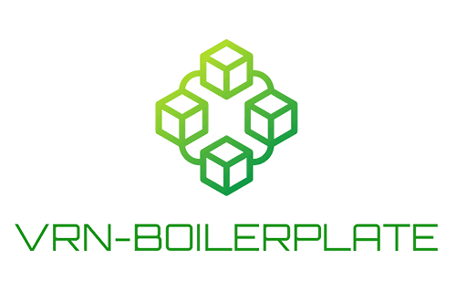

<div align="center">

<a href="https://github.com/vrn-deco/boilerplate">

</a>

[](https://github.com/vrn-deco/boilerplate/actions/workflows/deploy.yml)
[](http://commitizen.github.io/cz-cli/)
[](https://pnpm.io/)

[English](./README.md)

</div>

## 如何使用

如您需要拉取本仓库中的项目模板创建项目，推荐使用 `@vrn-deco/cli`

```sh
$ npm install -g @vrn-deco/cli

$ vrn create you-project
```

随后根据命令行提示交互式创建，详细使用和参数说明请查看 **[vrn-cli 仓库](https://github.com/vrn-deco/vrn-cli)**

## Boilerplate Packages

TODO

## Preset packages

TODO

## License

[MIT](./LICENSE)
